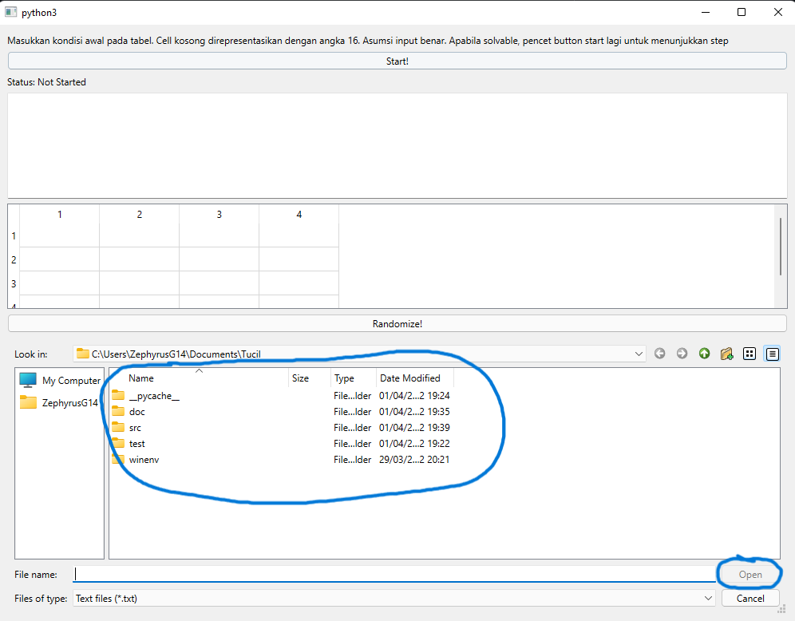
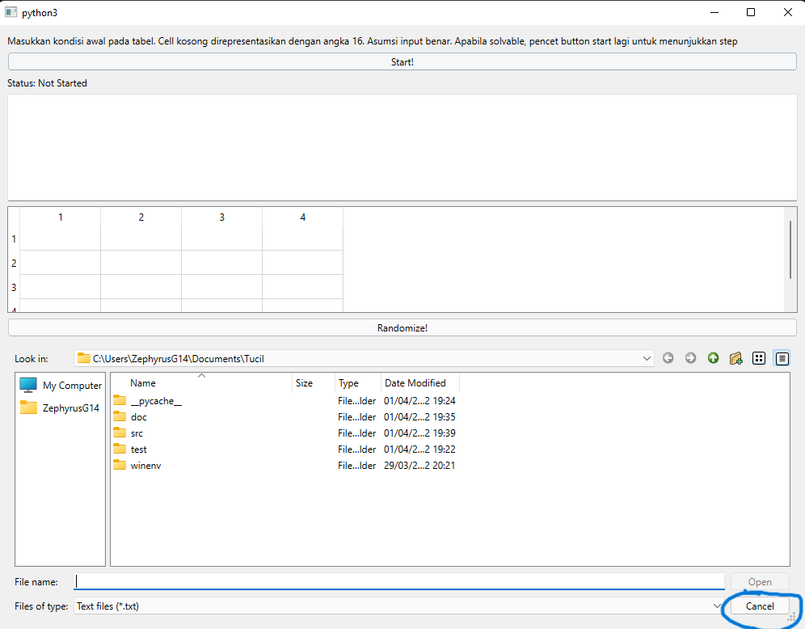
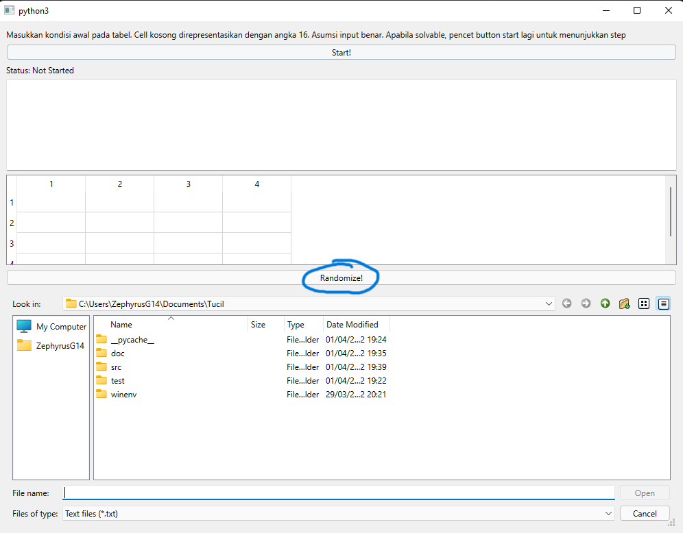
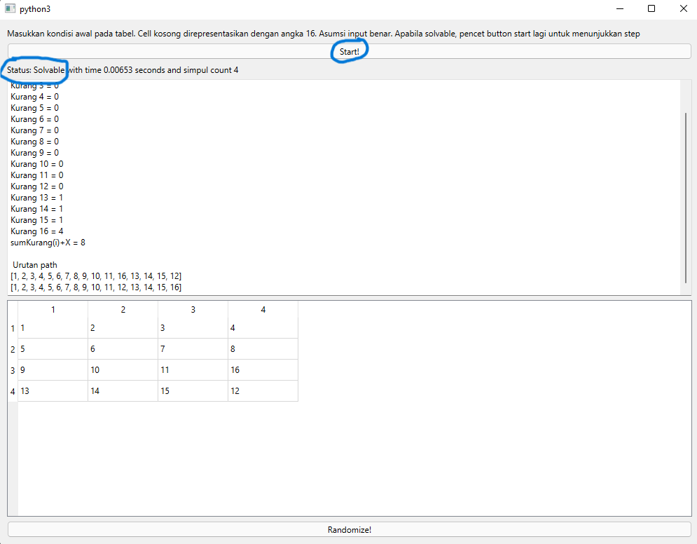
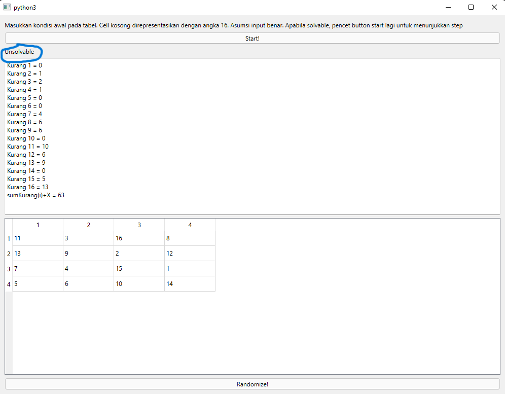

# Tugas Kecil 3 IF2211 Strategi Algoritma   Implementasi Branch and Bound untuk menyelesaikan 15 puzzle
> _Program Ini Dibuat Untuk Memenuhi Tugas Perkuliahan Mata Kuliah Strategi Algoritma (IF2211)_  
>
> _Program Studi Teknik Informatika  
> Sekolah Teknik Elektro dan Informatika  
> Institut Teknologi Bandung  
> Semester II Tahun 2021/2022  _

## Table of Contents
* [Description](#description)
* [Prerequisites](#prerequisites)
* [How to Run](#how-to-run)
* [Project Status](#project-status)
* [Contributors](#contributors)

## Description
- Program untuk menyelesaikan 15 puzzle menggunakan branch and bound
- Dibuat menggunakan Python dengan gui PySide6

## Prerequisites
> Pc windows 10/11. Jangan pakai wsl karena entah kenapa GUI nya tidak jalan. Linux mungkin jalan (tidak ditest)
> Python terinstall di pc versi minimum 3.9 (tidak di test untuk versi dibawah ini)

## Perhatian
> Program hanya dapat dijalankan di windows, tidak bisa di wsl
> Setelah digunakan, program harus ditutup dahulu baru dibuka kembali untuk reset. Tidak ada fitur reset dalam program

## How to Run
> 1. Masuk ke folder src `cd src`
> 2. Install dependencies dengan menggunakan `pip install -r requirements.txt`
> 3. Jalankan file main.py
> 4. Untuk menggunakan input file txt, gunakan file selector di bagian bawah. Jangan takut apabila tabel tidak langsung berubah. Tabel baru berubah setelah start
>     
> Apabila tidak ingin menggunakan input file txt, pencet cancel for free real estate
>     
> 5. Untuk menggunakan input random, gunakan tombol randomizer
>     
> 6. Pencet start
> 7. Apabila dapat disolve maka akan muncul status seperti ini. Anda dapat pencet next untuk melihat langkah selanjutnya pada tabel
>     
> 6. Apabila tidak dapat diselesaikan maka akan muncul status seperti ini.
>     

## Project Status
> **Project is: _complete_**
## Contributors
<table>
    <tr>
      <td><b>Nama</b></td>
      <td><b>NIM</b></td>
    </tr>
    <tr>
      <td><a href="https://github.com/dParikesit"><b>Dimas Shidqi Parikesit</b></a></td>
      <td><b>13520087</b></td>
    </tr>
</table>
